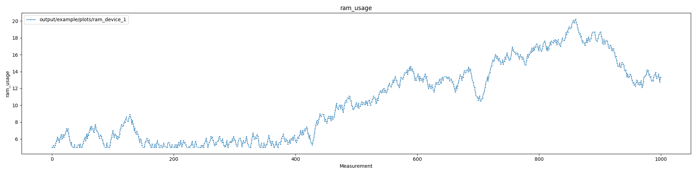

# WAPP
Wrapper-Around-Python-Parsing: small Python library to quickly parse log files

# Usage

Run:
```
python wapp.py configuration.json
```

with `configuration.json` describing the available data, and reports and plots to generate.

# Features

We take an in-depth look at the different features of WAPP by using snippets of the `examples/configs/example.json` configuration file and discussing its contents and results.

## Parse a single metric per log file

You can specify a specific metric that you want to parse in a log file, by adding this snippet in your configuration file:
```
{
    "metrics":{
        "examples/data/cpu_ram_usage_device_1.log":[
            {
                "name":"cpu_device_1",
                "parse_function":"parse_cpu",
                "metric":"cpu_usage",
                "report":1,
                "plot":1
            }
        ]
    }
}
```

The metrics (in the log files) that you want to parse are put in the `metrics` part of the configuration file.

Subsequently, you specify the _path to the log file_ in which you want to parse the metric. The metric part contains (or can contain following fields):

* `name`: names this metric in a general way, coupled to this particular log file, so it can be reference in comparison with similar metrics in other log files. The name should be unique over the whole configuration file.
* `parse_function`: specifies the parsing function to be used in the `src/wapp_functions` source file.
* `metric`: names the data that is parsed in this log file. Should be unique for this particular log file.
* `report`: indicates a `summary` and `data` report should be generated out of the parsed data. Not obligatory.
* `plot`: indicates an individual plot for this metric should be generated. Not obligatory.

## Extra plot details for metric plot

You can add additional information for an individual metric plot, such as the `x_label`, the `y_label` and the plot `title`:

```
{
    "metrics":{
        "examples/data/cpu_ram_usage_device_1.log":[
            {
                "name":"cpu_device_1",
                "parse_function":"parse_cpu",
                "metric":"cpu_usage",
                "report":1,
                "plot":1
                "plot_info":{
                    "x_label":"Timestamp",
                    "y_label":"Data rate (Mbit/s)",
                    "title":"Data rate over time"
                }
            }
        ]
    }
}
```

When `plot_info` or one of the parameters is not given, defaults values are used:
* `x_label`: "Measurement"
* `y_label`: the `metric` value
* `title`: the `metric` value

## Tailored parse function per metric

You specify a tailored parsing function per metric you want to parse, as can be seen in the feature above. Subsequently, you implement the parsing function in the `src/wapp_functions.py`:
```
def parse_cpu(line):
    pattern = re.compile("CPU usage is (\d+.\d+) %")
    is_match = pattern.search(line)
    if (is_match):
        return float(is_match.group(1))
    else:
        return None
```

In this `parse_cpu(line)` function, we make the choice to `return None` if no match is found. This has the consequence the parser will just continue to the next line.

If you are sure that you should find a match per line, it's probably best to raise an exception here to stop the program. This way, you get informed that the metric is not found in a line.

## Parse timestamp per line

If there are timestamps included in the lines of the log file, you can specify a specific timestamp parser function by using the `function` key in the `parse_timestamp` dictionary. Additionally, if you specify a timestamp function, you *must* also set the range which should be parsed by specifying the `start` and `stop` timestamp:

```
{
    "metrics":{
        "examples/data/rx_throughput_device_1.log":[
            {
                "name":"rx_throughput_device_1",
                "parse_function":"parse_throughput",
                "parse_timestamp": { 
                    "function":"parse_timestamp",
                    "start":"2023-10-02 21:00:00",
                    "stop":"2023-10-02 23:54:42"
                },
                "metric":"rx_throughput",
                "report":1,
                "plot":1
            }
        ]
    }
}
```

This `parse_timestamp` function is also executed on each line, just like the `parse_function` of a metric. The timestamp is then also added to the row in the data frame.

If no `parse_timestamp` function is given, `None` is added to the data frame in the column of the timestamp.

## Parse events

You can parse for certain "event" in your log file. These events will be indicated in your plots by a vertical line.

An example of an event can be:

```
2023-10-02 22:51:42 - RX throughput received is 2.20 Mbit/s.
2023-10-02 22:51:47 - RX throughput received is 2.28 Mbit/s.
2023-10-02 22:51:52 - RX throughput received is 2.50 Mbit/s.
2023-10-02 22:51:53 - --- EVENT Y ---
2023-10-02 22:51:57 - RX throughput received is 2.22 Mbit/s.
2023-10-02 22:52:02 - RX throughput received is 2.06 Mbit/s.
2023-10-02 22:52:07 - RX throughput received is 2.18 Mbit/s.
```

To indicate in your configuration to you want to parse and plot the event, you need to add the `parse_events` information:

```
        "examples/data/rx_throughput_device_1.log":[
            {
                "name":"rx_throughput_device_1",
                "parse_function":"parse_throughput",
                "parse_timestamp": { 
                    "function":"parse_timestamp",
                    "start":"2023-10-02 21:00:00",
                    "stop":"2023-10-02 23:54:42"
                },
                "parse_events": {
                    "event_x":"parse_event_x",
                    "event_y":"parse_event_y"
                },
                "metric":"rx_throughput",
                "report":1,
                "plot":1,
                "plot_info":{
                    "x_label":"Timestamp",
                    "y_label":"Data rate (Mbit/s)",
                    "title":"Data rate over time"
                }
            }
        ]

```

The functions to parse those events should be implemented in the `src/wapp_event_functions.py` file.

The result (indicated by the vertical green lines):


> [!CAUTION]
> You can only use events in log files where timestamps are present. Additionally, the file line containing the event should also contain a timemstamp.

## Parse multiple metrics per data file

You can parse multiple metrics in the same log file, simply by adding multiple metrics in the list of the same log file:

```
{
    "metrics":{
        "examples/data/cpu_ram_usage_device_2.log":[
            {
                "name":"cpu_device_2",
                "parse_function":"parse_cpu",
                "metric":"cpu_usage",
                "report":1,
                "plot":1
            },
            {
                "name":"ram_device_1",
                "parse_function":"parse_memory",
                "metric":"ram_usage",
                "report":1,
                "plot":1
            }
        ]
    }
}
```

## Parse multiple data files

You can parse multiple log files in the same run by adding all log files in the `metrics` dictionary:

```
{
    "metrics":{
        "examples/data/cpu_ram_usage_device_2.log":[
            {
                ...
            },
            {
                ...
            }
        ],
        "examples/data/cpu_ram_usage_device_2.log":[
            {
                ...
            }
        ],
        "examples/data/rx_throughput_device_1.log":[
            {
                ...
            }
        ]
    }
}
```

## Filenames for individual plots and/or reports

In the description of a metric, you can pass a name to the `report` and `plot` parameters. This name will be used for the individual reports and plot of the metric:

```
{
    "metrics":{
        "examples/data/cpu_ram_usage_device_1.log":[
            {
                "name":"cpu_device_1",
                "parse_function":"parse_cpu",
                "metric":"cpu_usage",
                "report":"report_cpu_device_1",
                "plot":"plot_cpu_device_1"
            }
        ]
    }
}
```

If no name is given, but you still want the reports and/or plot, you can just assign `1`, e.g., `"report":1`.

If no report or plot is needed, you can just drop the parameter from of the metric configuration.

## Multiple metrics on same graph

You can compare metrics of the same and/or different files in the same graph, by using the `plots` dictionary:

```
{
    "metrics":{
        ...
    },
    "plots":{
        "cpu_comparison":{
            "data":[
                "cpu_device_1",
                "cpu_device_2"
            ],
            "title": "CPU usage per device",
            "y_label":"CPU usage (%)",
            "x_label":"Measurement"
        }
    }
}
```

To select the data that has to be compared in the graph, you use the unique `name` parameter defined in each metric configuration.

You can add one or more graphs to this `plots` list. 

# Example

## Run example

To run the example, execute:

```
python wapp.py examples/configs/example.json
```

## Input files

The input files needed to run the example, are:
- the data files, to be found in `examples/data/`
- the JSON configuration file `example.json`, to be found in `examples/configs/`

## Output files

When WAPP is finished, it will make an `output` directory (if no such directory exists yet). In that directory, it will create a subdirectory with the name of the configuration JSON file. In our case, the `example` directory that contains:
- `plots` directory
- `reports` directory

## Graphs




